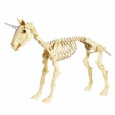

# Learning Journal 1.7
## Reading and discussion
### topic: Beginning Javascript 


I have always thought of web design being broken into three parts: 

- HTML (skeleton)

- Javascript (musicle, tendon, organs)

- CSS (skin, fur, hair, make up, clothes)


## HTML 


In the picture above all you see is a skeleton. This would be like the basic html structure determining what content goes where. 
```
<body>
    <h1> Hello World </h1>
</body>
```

## Javascript 


In this picure, we can start to see our unicorn fill out, it has functionality and muscle tissue but isn't complete. This would be like the functionality of a web page, it has buttons and links but they are not styled just yet. 

## CSS


And now we have style! We have a well rounded unicorn, it has parts in the right places, functionality, and last but not least style. This is the fully rendered magnificant web page. 
