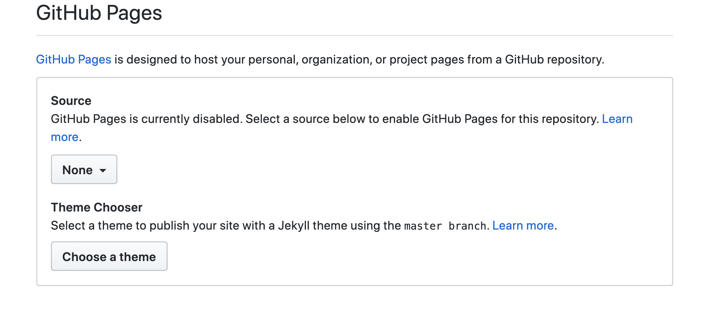

# Learning Journal 1.1
## Reading and discussion
### topic: GitHub Markdowns

 In this example I will show you something I recently learned. How to use a theme in your .MD files or sometimes called README. 
 To start I reccommend using [GitHub](https://github.com/).
 Initalize a repository with a README.md file included. Once the repository is built go to "Settings". Go to the section in settings called GitHub pages. 
 

 Select "Choose Theme".
 
 Once you have selected your theme it is automatically added to your repository as a .yml file. 
