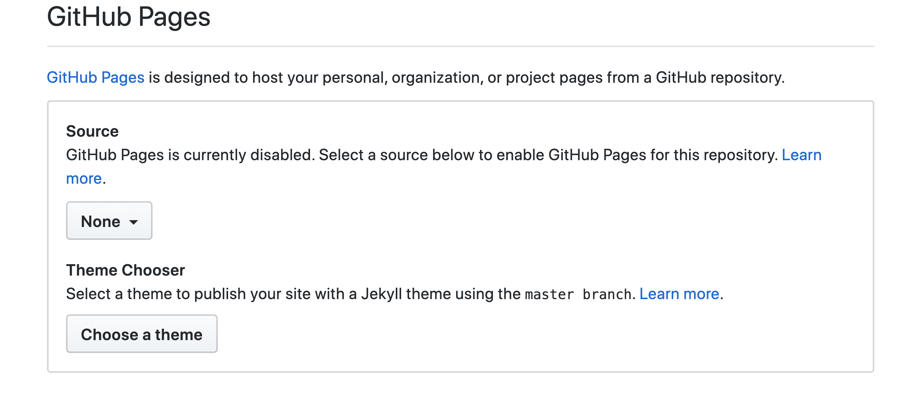

### In the immortal words of Rocky Balboa "*it ain't about how hard ya hit. It's about how hard you can get hit and keep moving forward. How much you can take and keep moving forward.*" -Rocky IV

 [*Watch me!*](https://youtu.be/D_Vg4uyYwEk)

## Hello world!

My name is Hollie Thomas. I am a returning student to Codefellows.
I look forward to collaborating with all of you as we go through this course.  

 
 When I think of keeping a growth mindset I go back to the above quote. I can't tell you how many times I have taken a swing at life but I **CAN** tell you how many times I have gotten hit. "**ain't no body gonna hit harder than life**". At the barest of principals growth mindset is being resilient and persistant.  

 It can also be a struggle. In addition to watching Rocky I also try and remind myself of these three things:

- Growth can be painful *think back to childhood "growing pains"
- Growth doesn't happen over night
- Growth requires sacrifice

My [Github](https://github.com/holliemaethomas) is a good example of times I have used growth mindset. I have failed more times than I have succeeded. My failures are my building blocks to my succeeses. 

# Learning Journal 1.2
## Reading and discussion
### topic: GitHub Markdowns

 In this example I will show you something I recently learned. How to use a theme in your .MD files or sometimes called README. 
 To start I reccommend using [GitHub](https://github.com/).
 Initalize a repository with a README.md file included. Once the repository is built go to "Settings". Go to the section in settings called GitHub pages. 
 

 Select "Choose Theme".
 
 Once you have selected your theme it is automatically added to your repository as a .yml file. 

# Learning Journal 1.3
## Reading and Discussion
### topic: Command Line cheat sheet

cd	Home directory

ls	Short listing

ls -l	Long listing

ls -a	Listing incl. hidden files

open .	Opens the directory
top	Displays active processes.

 Press q to quit

q	Exit

clear	Clear screen

touch [file]	Create new file

pwd	Full path to working directory

rm [file]	Remove a file, e.g. rm [file] [file]

rm -i [file]	Remove with confirmation

rm -r [dir]	Remove a directory and contents

rm -f [file]	Force removal without confirmation

rm -i [file]	Will display prompt before

cp [file] [newfile]	Copy file to file

cp [file] [dir]	Copy file to directory

mv [file] [new filename]	Move/Rename, e.g. mv -v [file] [dir]
